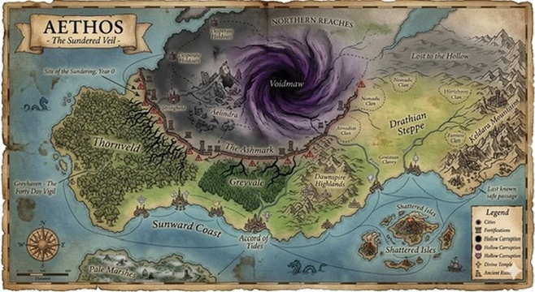

# Divine Ruin: The Sundered Veil — Product Overview

## What This Is

**A voice-first MMORPG.** Thousands of players sharing a persistent fantasy world, all experienced through voice and audio. You put on headphones, speak to an AI Dungeon Master, and enter a living world — not an instance, not a private room, but a shared persistent reality where other players are exploring the same cities, fighting the same war, and collectively unraveling the same mystery.

Think World of Warcraft meets D&D meets Audible — a massively multiplayer world where every interaction is spoken, every NPC is voiced, and the AI Dungeon Master adapts to everything that happens.

### The World at a Glance

The game is set in **Aethos**, a fantasy world tended by ten gods — each governing a domain of mortal life, from war to knowledge to healing. Thirty years ago, something shattered the Veil, the barrier between Aethos and whatever lies beyond. Through the breach pours the **Hollow** — creatures that aren't monsters in any familiar sense. They don't speak, don't negotiate, don't make sense. They simply consume. The gods disagree on what the Hollow are and how to fight them. The great city of Aelindra has already fallen; what remains is a wound in reality called the Voidmaw. The surviving civilizations have rallied, but the Hollow is spreading — and buried in the history of this catastrophe is a secret that could shatter the world's faith entirely: **one of the gods is responsible.**

Players enter this world, choose a patron deity, and begin unraveling the mystery across seasons of play — while fighting the Hollow, navigating faction politics, and building a life in a world that's running out of time.



*The world of Aethos, showing the Voidmaw corruption in the north, the Ashmark defensive line, and the surviving civilizations of the south.*

### What Makes This an MMO, Not Just an RPG

**Shared persistent world.** When you walk into the Accord of Tides, you're in the same city as hundreds of other players. Some of those voices in the tavern are real people. The merchant you trade with might be another player's Artificer running a shop. The guild that controls the northern trade route is a player guild that fought for it last week.

**Open-world encounters.** You're exploring the Greyvale and you hear footsteps ahead. Another party — real humans — approaching from a different direction. Your DM and theirs coordinate. You can team up, trade information, clash, or pass like ships in the night. Not matchmade. Organic.

**Player-driven economy.** Thousands of players crafting, trading, and consuming. Supply and demand driven by real behavior. An Artificer who forges a legendary weapon sells it to another player. A merchant guild's prices fluctuate based on trade route control. An influx of Hollow refugees drives up food costs in the southern cities.

**Faction and guild politics.** Guilds claim territory, build strongholds, and project power. Factions compete for influence — through diplomacy, trade, espionage, and war. These aren't scripted story beats; they're the emergent result of thousands of players making decisions. The god-agents watch, intervene, and reshape the world in response.

**The world responds to everyone.** A thousand players discover the same clue in different sessions — the god-agents notice and the world narrative shifts. A faction wins a territorial war — the map changes for every player. The Hollow pushes south — every player in that region hears the soundscape darken. Your actions matter, and so do everyone else's.

**The mystery is collective.** The central storyline — who shattered the Veil, and why — unfolds through clues scattered across thousands of sessions. No single player sees the whole picture. Community theorycrafting, information brokering, and cross-faction intelligence sharing drive the meta-narrative forward. When the truth is finally revealed, it's a moment the entire player base experiences together.

### Why This Doesn't Exist Yet

Three technologies matured simultaneously in 2025-2026: LLMs capable of sustained, high-quality narrative improvisation (Claude). Text-to-speech that sounds human and can switch voices instantly (Inworld TTS-1.5). Real-time voice infrastructure that handles multiple concurrent speakers with sub-second latency (LiveKit). Separately, each enables incremental products. Together, they enable a new medium — an AI dungeon master that listens, thinks, narrates, and voices an entire world in real-time, at MMO scale.

**No one has shipped this.** AI Dungeon proved LLMs can run RPGs (text only, single-player, no persistence). Character.AI proved people will talk to AI characters for hours. Traditional MMOs proved persistent shared worlds create deep engagement. We're building at the intersection: a voice-native, massively multiplayer, persistent-world RPG where every player has a personal AI dungeon master and every session takes place in a shared living world.

### Why Voice-First Is the Right Medium

Voice isn't a gimmick or an accessibility feature — it's a fundamental design advantage.

**Imagination is the graphics engine.** Audio-described worlds are more vivid than rendered ones because the player's brain fills in the imagery. Horror games and radio dramas have proven this for decades. A voice-described dragon is scarier than a 3D-modeled one. And unlike a rendered MMO, the world can be infinite — describing a new location costs no more than describing an old one.

**The input IS the gameplay.** Talking to NPCs, negotiating with merchants, shouting combat orders, casting spells through incantations, deceiving enemies through conversation, recruiting strangers into your guild — voice makes social and creative play the core mechanic, not a secondary system layered on top of combat.

**Voice makes strangers into allies.** The reason MMOs create lasting friendships is shared experience. Voice amplifies this — you don't just group with someone, you *talk* to them. You hear the panic in their voice during combat, the excitement when loot drops, the trash talk between rivals. The social fabric of the MMO is woven from voice, not text chat.

**Audio is ambient.** Players can engage while commuting, walking, lying in bed, or doing chores. The session fits into life rather than demanding undivided screen attention. The phone screen is a glanceable HUD, not the primary interface. This dramatically expands when and where people can play an MMO.

**The target audience already exists.** The LitRPG and progression fantasy community is massive, audio-native (enormous Audible crossover), and primed for exactly this product. They already consume fantasy through audio and imagine themselves in these worlds. We're building the interactive version — at scale.

---

## What It Feels Like to Play

You put on headphones. You hear the Accord of Tides — waves against the harbor, vendors calling prices, the clatter of a dozen conversations. Some of those voices are NPCs. Some are other players. The DM's voice sets your scene, narrating what's immediately around you. You speak naturally: *"I want to find the blacksmith."*

The DM narrates your walk through the market. You pass a pair of players arguing about whether to take the northern or southern route to the Greyvale — their DM is handling their session simultaneously in the same city. You arrive at the forge. The blacksmith remembers you from last session. You negotiate a price, pick up the sword you commissioned three days ago (it was crafting while you were offline), and head to the guild hall.

A guild recruitment notice catches your attention — a player-run guild called the Ashwalkers is looking for scouts. You make a mental note. At the guild hall, two friends join your room. The DM addresses all of you, recaps last session, and sets the hook: something is wrong in the Greyvale.

You ride out. The city sounds fade behind you. The forest sounds shift as you head north. Another party passes you heading south — they look roughed up. "Turn back," one of them says. "It's worse than they told us." Your DM weaves their warning into your narrative.

Combat erupts. The DM's voice goes sharp and urgent. Everyone shouts their intent at once. Dice roll. The DM narrates a cinematic sequence of the entire round. Your companion NPC shouts a warning from your left. You hear something behind you that doesn't sound like anything that should exist.

After the session, your patron deity whispers a cryptic message. You check the guild board — the Ashwalkers posted a bounty on Hollow nests in the region you just explored. You set your character to train overnight, submit a scouting report to the Ashwalkers, and log off. The world keeps turning. Tomorrow, you'll check in for 5 minutes, hear the results, and make your next decision. The war doesn't wait.

---

## The World

**Aethos** is a fantasy world under existential threat. Thirty years ago, something tore through the Veil — the barrier between reality and what lies beyond. Creatures pour through that are not monsters in any familiar sense. They are alien, incomprehensible, and cannot be reasoned with. The world's ten gods disagree on what the creatures are and how to stop them. Thousands of players collectively unravel the mystery across seasons of play.

The enemy's incomprehensibility is a deliberate design decision: it prevents "dark side" faction play, keeps the community fundamentally cooperative against the external threat (while allowing rich internal politics), and maximizes horror in audio — something you can't understand is scarier than something you can.

### The Pantheon as Game Systems

Each god governs specific game mechanics, giving the world's rules narrative grounding:

| God | Domain | Governs |
|---|---|---|
| **Veythar, the Lorekeeper** | Knowledge | Magic systems, lore discovery |
| **Kaelen, the Ironhand** | War | Combat systems, martial classes |
| **Aelora, the Hearthkeeper** | Civilization | Crafting, trade, guilds, property |
| **Syrath, the Veilwatcher** | Shadows | Stealth, espionage, hidden quests |
| **Orenthel, the Dawnbringer** | Healing | Healing systems, sanctuary |
| + 5 more | | |

Players choose a patron deity. Divine patronage flavors their class abilities, shapes their quest lines, and creates natural faction dynamics. The gods are autonomous AI agents running on heartbeat loops — making strategic decisions, generating quests, responding to collective player behavior, and interacting with each other. When a thousand followers of Kaelen push into contested territory, the war god notices and responds. When Syrath's agents discover a hidden truth, the shadow god decides who learns it and when.

### The Long Game

There is an overarching mystery that unfolds across seasons. One of the gods is responsible for the Veil's shattering — and the clues are buried in the world's history, contradictions in the gods' stories, and artifacts players discover during play. Thousands of players collectively piece together the truth. God-agents synthesize discoveries and adjust the narrative. No single player sees the whole picture. Factions form around competing theories. Information brokers trade clues. The community drives the story forward, and the payoff — when it comes — will hit differently depending on which god you chose.

*The full lore is documented separately. It's worth reading — the narrative design is as ambitious as the technical design.*

---

## How It Works

### The AI Dungeon Master

Every player has a personal DM agent — but all DM agents operate in the same shared world. Your DM knows the global world state, the players nearby, the faction conflicts in your region, and the consequences of what every other player has done. The experience is personal; the world is shared.

The DM is not a single model — it's a three-layer agent:

| Layer | Role | What It Does |
|---|---|---|
| **Voice Agent** | Real-time conversation | Listens, narrates, voices characters, calls tools. The hot path — every word the player hears comes through here. |
| **Background Process** | World awareness | Watches for world changes (location shifts, combat, god-agent events, nearby player activity), rebuilds the DM's context, triggers proactive narration when something important happens nearby. |
| **Tool System** | Game mechanics | ~20 tools across 4 categories: world queries, dice/mechanics, game state mutation, client effects. The DM decides *when* a check is needed; the rules engine decides *how* it resolves. |

The DM voices all characters through a ventriloquism system — narrator, companion, merchants, quest-givers, gods — by tagging dialogue with character names and emotions. The TTS pipeline routes each segment to a unique voice. One agent, many characters, seamless audio.

As the game matures, key NPCs can be promoted to independent agents with their own LLM sessions and voice tracks — the architecture supports this without client changes.

### The Voice Pipeline

```
Player speaks → client-side VAD detects speech →
audio streams to server → Deepgram STT (streaming) →
DM agent processes intent → calls tools if needed →
Claude generates response (streaming) → 
Inworld TTS (streaming, <250ms latency) → 
player hears the DM respond
```

**Target: first audio response in ~1.2–2.0 seconds.** The DM starts speaking before the full response is generated — streaming LLM output into streaming TTS, sentence by sentence.

### Technology Stack

| Component | Choice | Why |
|---|---|---|
| **Transport** | LiveKit | Open-source WebRTC. Agents join rooms as participants. Each player's audio is a separate track — no speaker diarization needed. |
| **STT** | Deepgram Nova-3 | Streaming with interim results. The DM starts processing before the player finishes speaking. |
| **TTS** | Inworld TTS-1.5 Max | #1 ranked quality, <250ms latency, voice cloning, expressiveness controls. Built for game NPCs. 3× cheaper than alternatives. |
| **LLM** | Claude (Haiku) | Narrative quality + tool use reliability. Streaming. Prompt caching cuts repeated context cost by ~90%. |
| **Client** | Expo (React Native) | Single codebase for iOS and Android. Thin client — voice connection + glanceable HUD. |
| **Database** | PostgreSQL + Redis | PostgreSQL for persistent world state (JSONB). Redis for hot-path cache (60s TTL, rebuild on miss). |

### MMO Architecture

The shared world is made possible by the separation of DM agents (per-player) from world state (shared). Every DM agent reads from the same world database and writes to the same event bus. When player A sells an item to a merchant in the Accord of Tides, player B's DM knows about the reduced inventory when they visit the same merchant minutes later. When a guild conquers a keep, every DM in that region updates its narrative context.

**Rooms and proximity.** Players in the same location share a LiveKit room and can hear each other directly. Their DM agents coordinate through the shared event bus. When a player moves to a new location, they seamlessly transition to the room for that area. Population density determines the acoustic environment — a busy market sounds different from an empty one, and the voices you hear are a mix of NPC ambience and real players.

**Cross-session persistence.** Everything persists. Your inventory, reputation, quest progress, NPC relationships, guild membership, property ownership, faction standing — all stored in the shared world database. The world itself persists: NPC schedules continue, the economy ticks, corruption spreads, factions advance their agendas, gods make decisions. When you log back in, the world has moved forward, and your DM catches you up.

---

## Game Systems

### 16 Class Archetypes × 10 Gods

Six categories — Martial, Arcane, Primal, Divine, Shadow, Support — with 2-3 archetypes each. Every archetype can follow any god, creating 160 possible combinations with distinct playstyles and narrative identities. A Rogue serving the god of justice is a very different character than a Rogue serving the god of shadows.

### Voice-First Combat

Phase-based, not turn-by-turn. All players declare intent simultaneously, dice resolve, and the DM narrates the entire round as a cinematic sequence. Interrupt mechanics let players shout reactions mid-narration. Timer pressure on declarations rewards decisiveness. Sound design IS the tactical environment — spatial audio positions enemies around you.

### Synchronous + Asynchronous Play

**Sync sessions** (30-90 min) are the main event: real-time voice RPG with your party and the AI DM, in the shared world. **Async activities** are the connective tissue between sessions: crafting timers, training, side quests, god whispers, faction management, guild coordination, trade. Every async check-in is AI-narrated. The world runs on a real-time clock (1 game-minute = 1 real minute), so it evolves whether you're playing or not — and so does everyone else's activity.

### Multiplayer at Every Scale

| Scale | Experience |
|---|---|
| **Solo** | You + AI companion + DM. A personal story in a shared world. |
| **Party** (2-4) | Friends or strangers tackling content together. The core group experience. |
| **Guild** (10-50+) | Persistent social structure. Territory control, shared resources, guild storylines. |
| **Faction** (hundreds-thousands) | Patron deity alignments creating natural mega-alliances. Faction wars, political intrigue. |
| **World** (all players) | The collective mystery. Seasonal events. World-state shifts driven by aggregate player behavior. |

LiveKit rooms with 1-4 human players plus the DM agent per party. Client-side VAD means players just talk — no push-to-talk button. The SFU delivers each player's audio as a separate track, so the DM always knows who's speaking. Parties form through friends lists, guild halls, matchmaking, or open-world encounters with strangers.

---

## Monetization

Higher per-user costs than a traditional MMO — every interaction involves real-time AI inference, voice synthesis, and speech-to-text. We've modeled it in detail: **margins are healthy across all player profiles at the target subscription price.** TTS is the dominant cost (~53% of session cost), the LLM is surprisingly cheap (~15%), and party play is dramatically cheaper per player than solo.

- **7-day free trial** of the full experience (marketing spend, not a crippled free tier)
- **Premium subscription (~$15-20/month):** Unlimited sync, full async, premium DM narration
- **Battle pass** tied to seasonal story arcs
- **Voice cosmetics:** In a game with no visual character model, your voice IS your identity. Character voices, weapon sounds, spell effects, critical hit signatures.
- **Narrative cosmetics:** Personalized backstory integration, titles NPCs use for you, personal legends bards sing about in taverns
- **Property system:** Audio-defined spaces (a seaside cottage IS its soundscape). Earn through play or purchase to accelerate.
- **Guild cosmetics and prestige:** Guild hall upgrades, custom guild audio themes, commissioned narrative events (your guild's founding story becomes world canon)

**Red lines:** No pay-to-win. No stat boosts for money. No pay-to-skip-grind. All purchases are lateral — cosmetic, narrative, experiential, or convenience.

**Unit economics (30-min solo session):** ~$0.40 per session. At $17.50/month, even the heaviest solo player (12 sessions/month, 45 min each) runs at 52% gross margin. Party players are cheaper per-head. At 10,000 subscribers: 84% gross margin. At 100,000: 89%.

---

## Where We Are

### What Exists

- Seven living design documents totaling 55,000+ words: product overview, lore bible, game design, MVP spec, technical architecture, world data & simulation, cost model
- Technology stack selected and validated through research: LiveKit + Deepgram + Claude + Inworld TTS
- Full architecture defined: DM agent (three-layer), client app (Expo), orchestration, multiplayer, world simulation, content pipeline
- Unit economics modeled and validated across all player profiles
- Testing strategy defined across five tiers: infrastructure, rules engine, DM behavior evaluation, experience quality, content quality
- MVP scoped: one city district, one wilderness zone, one 3-5 session story arc, ~110 content entities

### The Path from MVP to MMO

The MVP proves the core experience: **does a voice-first RPG session feel magical?** A single 30-minute session with 1 player, an AI DM, an AI companion, one combat encounter, and one narrative encounter. If that works, the path to MMO scales through:

1. **Core voice loop** — Prove the DM conversation works (solo, one location)
2. **Game mechanics** — Prove the tool system, combat, and state management work
3. **Small multiplayer** — Prove 2-4 players in a shared room with one DM works
4. **Shared world** — Prove multiple parties in the same world with cross-session persistence works
5. **Open-world encounters** — Prove organic player-to-player meetings and DM coordination works
6. **Guild and faction systems** — Prove player-driven politics, territory, and economy at scale
7. **Seasonal narrative** — Prove the collective mystery and god-agent meta-narrative works across thousands of players

Steps 1-3 are the MVP. Steps 4-7 scale it into the MMO. The architecture is designed for the full vision from day one — the DM agent reads from a shared world database, not a private instance. The path from "one player in one room" to "thousands of players in one world" is additive, not a rewrite.

---

## The Hard Problems

What makes this worth building:

**Voice pipeline latency.** The entire experience depends on sub-2-second voice-to-voice response. Every component streams into the next — partial STT results feed LLM processing, partial LLM output feeds TTS synthesis. The latency budget is specified down to the millisecond.

**AI DM quality.** The DM must narrate, improvise, manage rules, voice multiple characters, maintain continuity across sessions, and adapt to player behavior — all in real time. A three-layer prompt architecture (static persona + world-aware warm context + per-turn hot injection) keeps the DM accurate without re-processing the full world state on every turn.

**Multiplayer voice coordination.** Multiple humans and AI agents in one room, with VAD-based input, simultaneous speech handling, and a shared narrative that stays coherent. A 500ms collection buffer batches near-simultaneous inputs. No one has built this for a game before.

**Shared world at scale.** Thousands of DM agents reading from and writing to the same world state, without conflicts, without stale data, without the world feeling fragmented. The event bus, the cache layer, and the simulation ticks must keep every DM's context accurate in near-real-time.

**A living world.** Four simulation layers run continuously: time-driven NPC schedules, 10-minute world ticks (corruption drift, economy, weather), god-agent heartbeats making strategic decisions, and event-driven cascades where player actions ripple outward. The world must feel alive even when players aren't in it — and the changes must be visible to everyone.

**Content at scale.** A two-tier authoring system: hand-crafted tier 1 entities (major NPCs, key locations, story quests) backed by AI-generated tier 2 entities (minor characters, filler locations, common items) that the DM improvises from. On-demand generation fills gaps as players explore beyond authored boundaries. The world must be large enough for thousands of players without feeling empty or repetitive.

**Player-driven emergence.** The hardest problem of all: creating systems that produce emergent behavior at scale. Guild politics, faction wars, economic shifts, information networks, reputation cascades — these can't be scripted. They arise from the interaction of thousands of players making decisions in a shared world with consistent rules. The game design must create the conditions for emergence; the technology must support it.

---

## The Deeper Documents

| Document | What It Covers |
|---|---|
| **Aethos Lore Bible** | World history, cosmology, the pantheon, geography, peoples, cultures, the core mystery |
| **Game Design Document** | Character creation, 16 class archetypes, progression, combat, navigation, NPCs, economy, death mechanics, the opening experience, monetization |
| **MVP Specification** | Scoped first build: what we're building, what we're proving, playtest structure, success criteria |
| **Technical Architecture** | Client app, voice pipeline, DM agent architecture, orchestration, multiplayer, testing strategy, latency budget |
| **World Data & Simulation** | Content authoring format (JSON schemas), world simulation rules (4 layers), data model, god-agent integration |
| **Cost Model** | Per-session unit economics, subscriber margin analysis, TTS provider comparison, optimization paths |

---

*If this sounds like something you want to build, let's talk.*

---

## Local Development Setup

### Prerequisites

- [Bun](https://bun.sh) (v1.0+)
- [Python 3.11+](https://www.python.org/) with [uv](https://docs.astral.sh/uv/)
- [Docker](https://www.docker.com/) & Docker Compose
- API keys: LiveKit, Anthropic, Deepgram, Inworld

### 1. Start infrastructure

```bash
docker-compose up -d
```

PostgreSQL on `localhost:5433`, Redis on `localhost:6379`.

### 2. Configure environment

```bash
cp .env.example .env
# Fill in: LIVEKIT_URL, LIVEKIT_API_KEY, LIVEKIT_API_SECRET,
#          ANTHROPIC_API_KEY, DEEPGRAM_API_KEY,
#          INWORLD_API_KEY, INWORLD_WORKSPACE_ID
```

The agent also reads from `apps/agent/.env.local` for LiveKit credentials.

### 3. Install dependencies

```bash
bun install                            # TS workspace (root)
cd apps/agent && uv sync && cd ../..   # Python agent
```

### 4. Run migrations and seed content

```bash
bun run migrate   # Create database schema (19 tables)
bun run seed      # Load locations, NPCs, quests, items, factions
```

### 5. Start services

**REST API server:**
```bash
bun run dev:server    # http://localhost:3000
```

**DM Agent (voice pipeline):**
```bash
cd apps/agent
uv run python agent.py dev
```

The `dev` subcommand creates a LiveKit room and waits for a participant to join.

**Mobile client (optional):**
```bash
bun run dev:mobile    # Expo dev server
```

### 6. Join a voice session

Connect to the room the agent created using any of:

- **`lk` CLI:** `lk room join --room <room-name>`
- **LiveKit Playground:** [playground.livekit.io](https://playground.livekit.io)
- **Expo app:** scan the QR code from `dev:mobile`

### Running tests

```bash
bun test                        # TS tests (server, shared)
cd apps/agent && uv run pytest  # Python tests (agent)
```
